# Chiang-Rai
<html lang="ja">
 <head>
  <meta charset="utf-8" />
 
   
</head>
<body>
<h1><marquee behavior="alternate">!!! Chiang-Rai !!!</marquee></h1>

20140505、あしかがフラワーパーク

                              

<marquee direction="right" scrollamount="20" width="30%">(^_^)/~hada</marquee>

<h2><marquee behavior="alternate">!!! 2015年11月7日、日光 !!!</marquee></h2>

<h3>↓ 画像はクリックで拡大します。閲覧後はブラウザの戻るボタンでお戻りください。</h3>

<a href="151107_10.JPG" class="preview">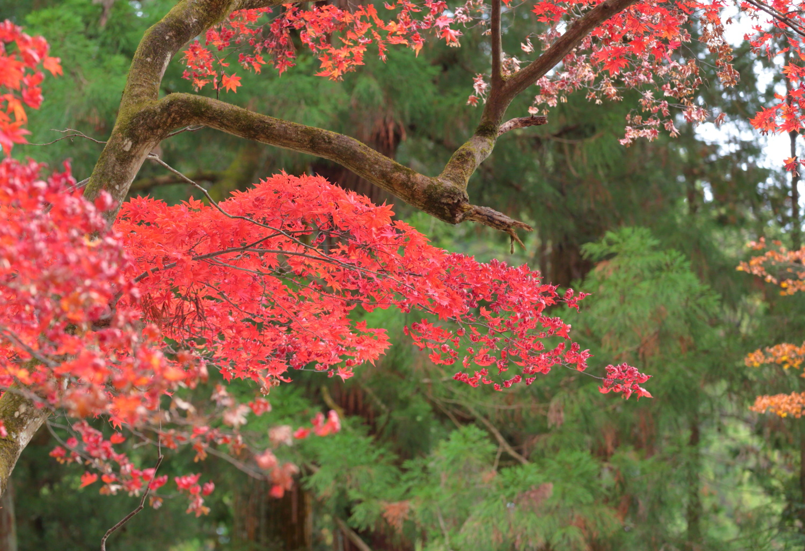</a>

  

     
<h2><marquee behavior="alternate">!!! 2015年10月18日、ひたち海浜公園 !!!</marquee></h2>

<h3>↓ 画像はクリックで拡大します。閲覧後はブラウザの戻るボタンでお戻りください。</h3>

<a href="151018_01.JPG" class="preview">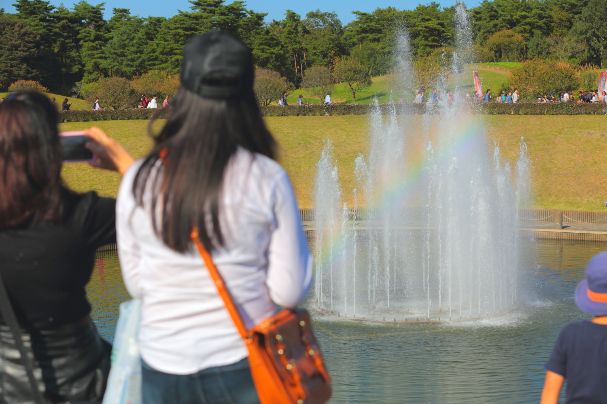</a>

<a href="151018_02.JPG" class="preview">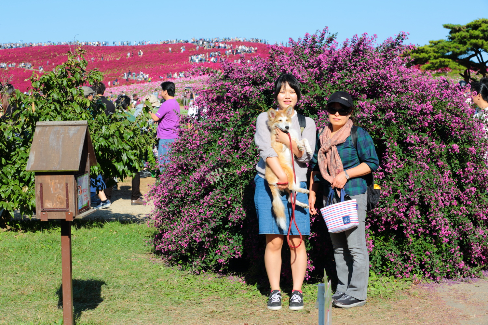</a>
<a href="151018_03.JPG" class="preview">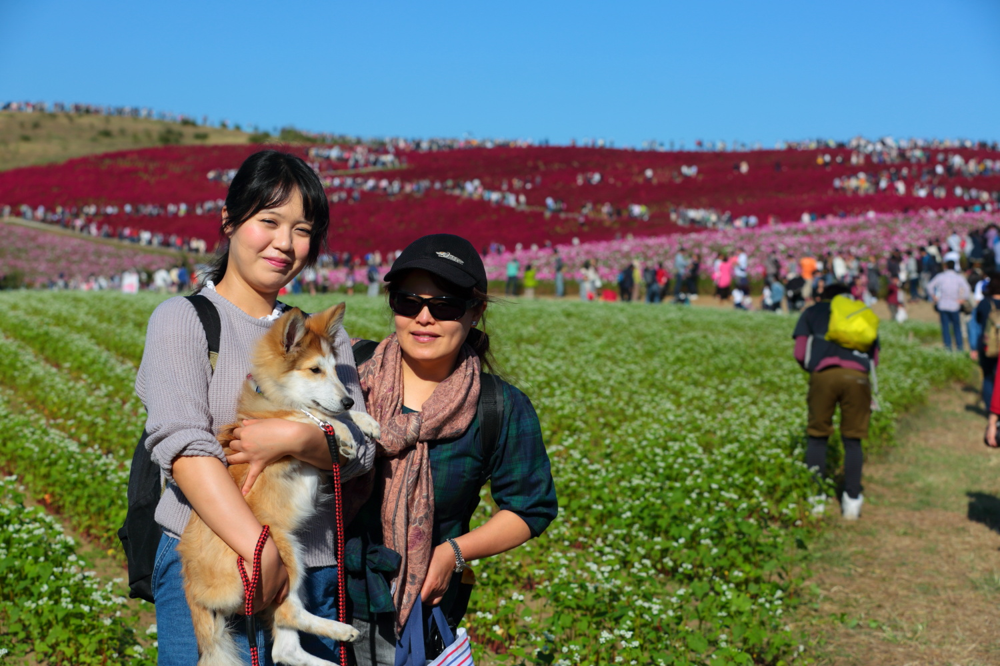</a>

<a href="151018_08.JPG" class="preview">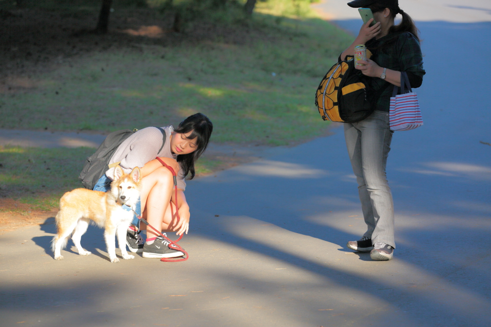</a>

  

     
<h2><marquee behavior="alternate">!!! 2014年5月5日、あしかがフラワーパーク !!!</marquee></h2>

<h3>↓ 画像はクリックで拡大します。閲覧後はブラウザの戻るボタンでお戻りください。</h3>
<a href="140505_01.JPG" class="preview">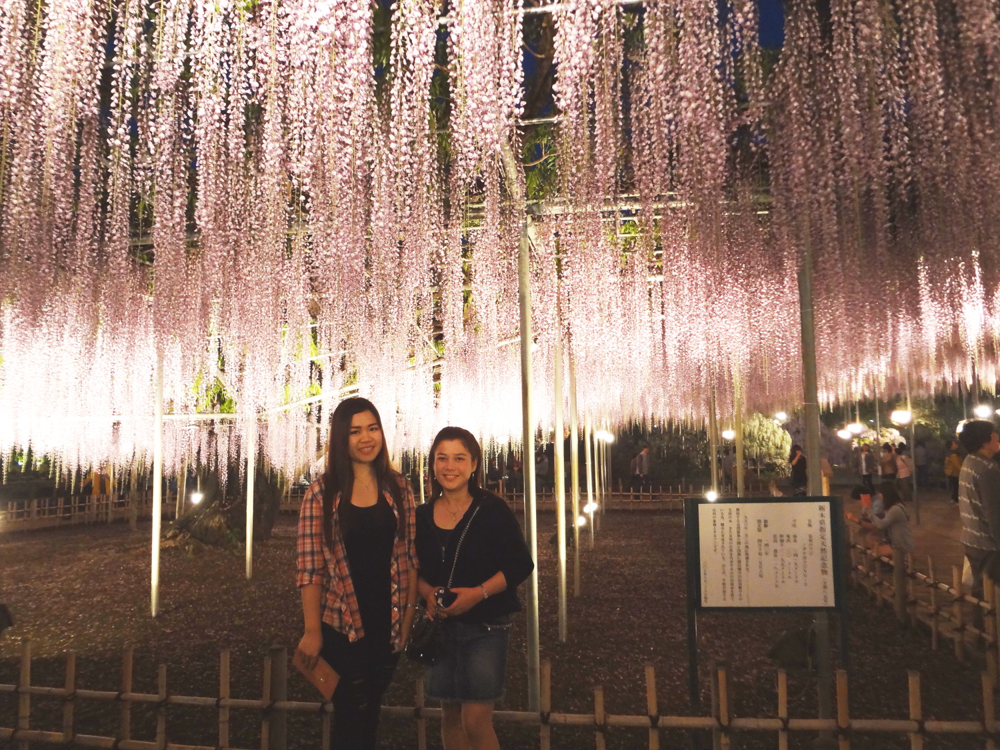</a>

<a href="140505_04.JPG" class="preview">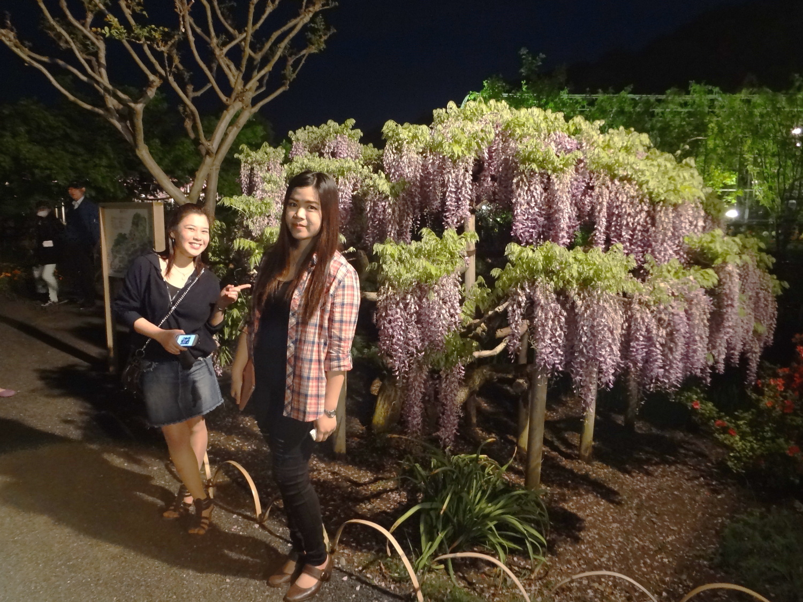</a>

<a href="140505_11.JPG" class="preview">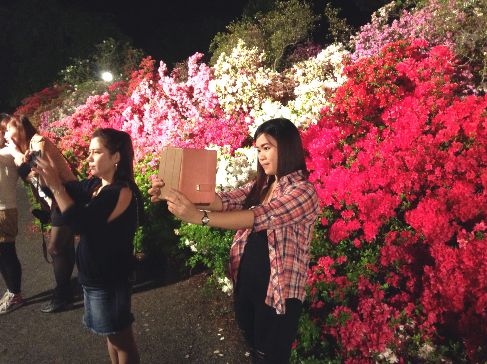</a>

  

     	
<h2><marquee behavior="alternate">!!! 2013/5/3、はが、しばさくらこうえん、おおやいし !!!</marquee></h2>

<h3>↓ 画像はクリックで拡大します。閲覧後はブラウザの戻るボタンでお戻りください。</h3>

<a href="130503_02.JPG" class="preview">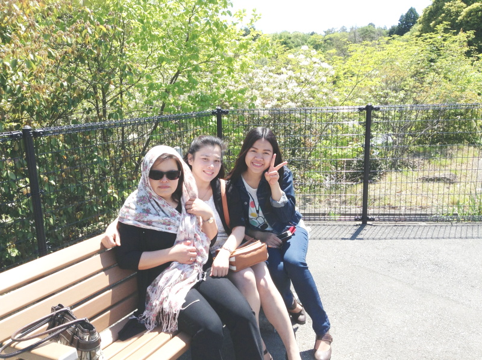</a>
<a href="130503_03.JPG" class="preview">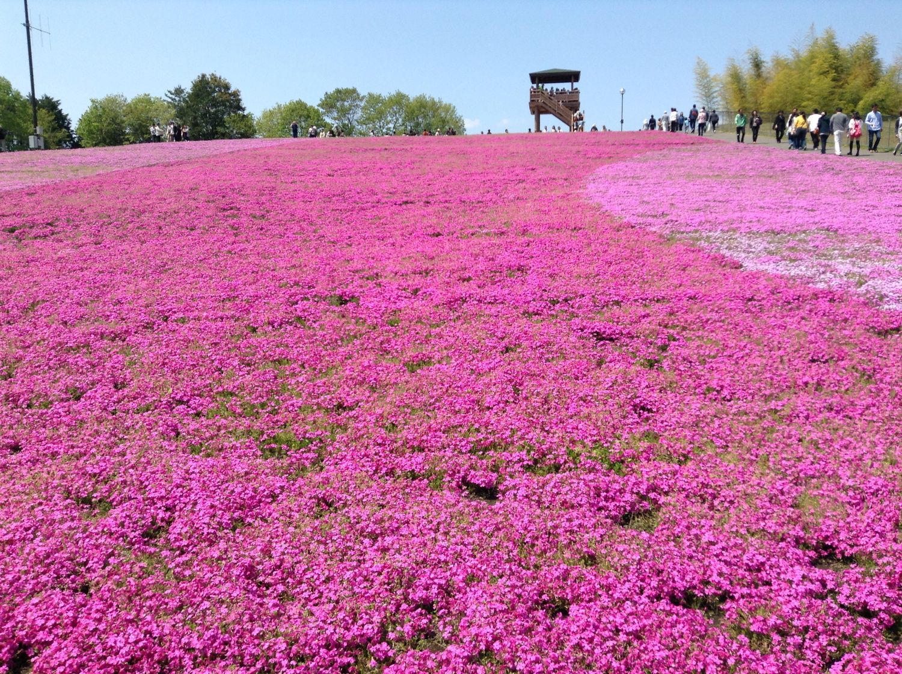</a>
<a href="130503_05.JPG" class="preview">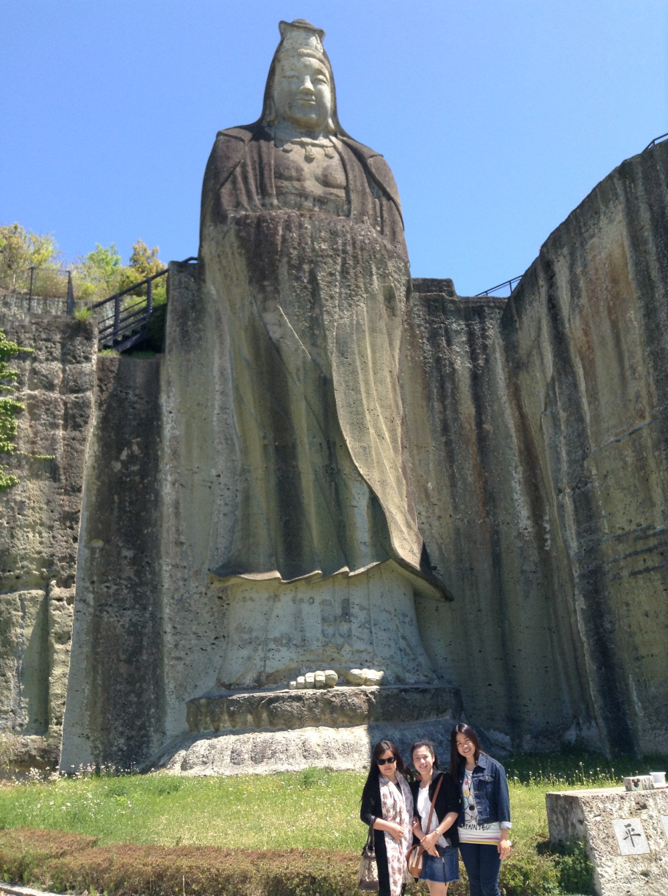</a>

  
                                  	
  </body>

</html>
  

<!-- フッタ -->
 <footer>
 Copyright 2018/07/14 S.Hada
 </footer>
